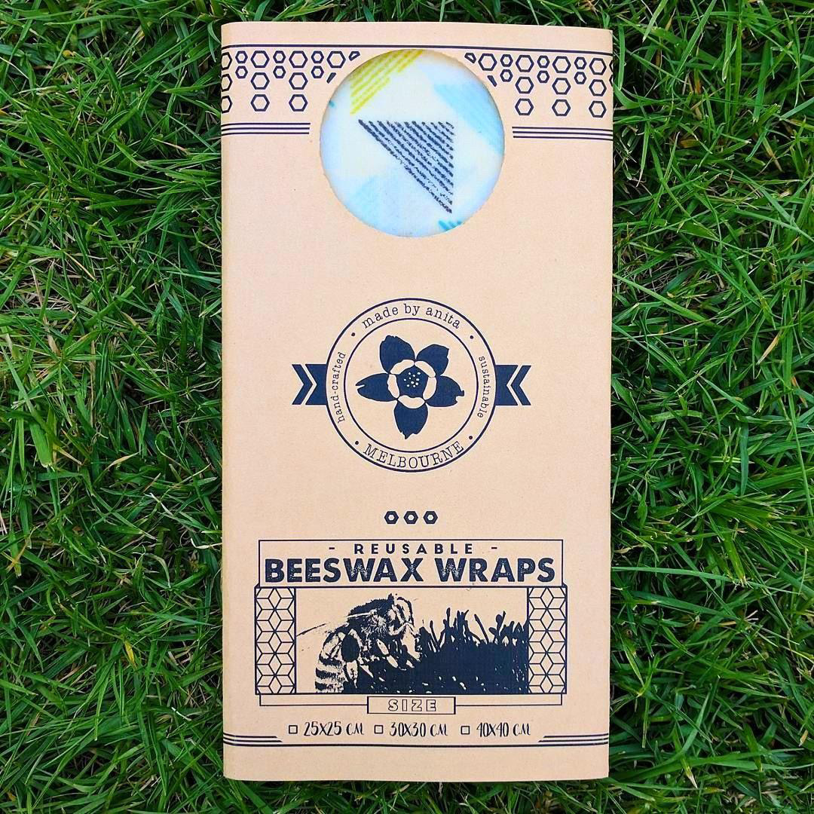
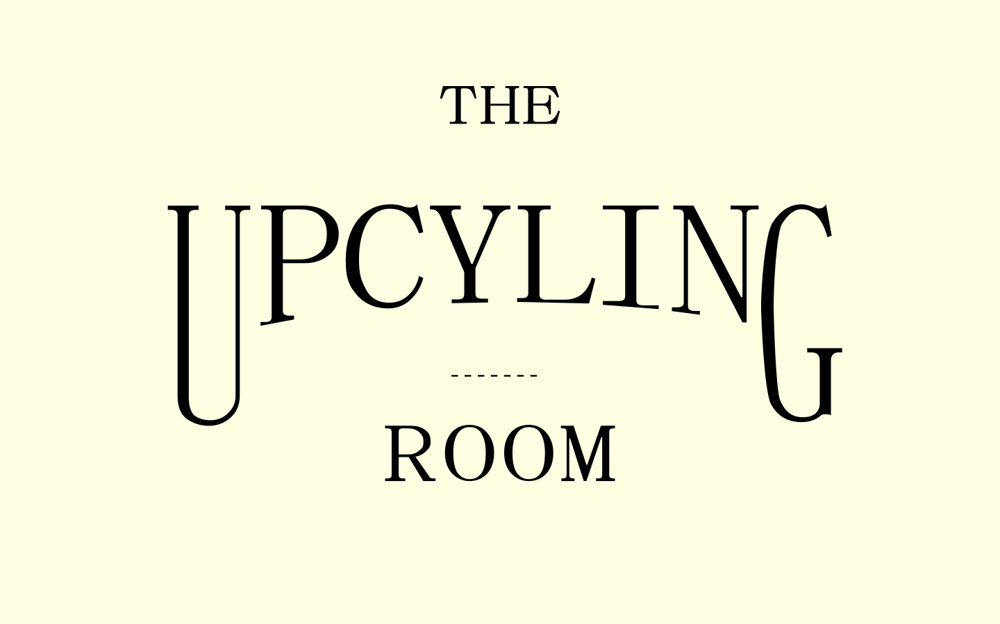

# `Project 0's`
- *All my project folders (yes I was a very organised lil guy) - whatever I kept from the first laptop 
- (were mainly 3d-rendering/graphic design over coding)*

1->2->3

## Professional: Donovan Project 
#freelance #middleschool #consulting

---
#### The Upcycling Room: Sustainable Beeswax Wraps Packaging
`For: local startup`

      

`+ also designed a sales website TheUpcyclingRoom.com`

---
#### Hawaii Tour Business Card

![[back.png | 250]]![[KEn 1.png|250]]
![[image5763.png | 250]]

---

#### Textbooks

![[Yr6Sci.png | 100]]![[Yr8Cells.png| 100]]![[Yr8Chem.png|100]]![[Yr8CompAnat.png|100]]![[Yr9Sci.png |100]]![[Yr9SciGam.png|100]]
- Not the best

---

#### Invisible Cities
`Printed and distributed`

![[v5 render.png|250]]

---

#### Dream Bedroom (3D Graphics)
`Blender | COVID-19 Lockdown Inspired`

![[dream-bedroom-build/render.png | 500]]
![[1st draft.png|500]]
- (I was really into the show Agents of Shield at the time)

---
#### Fever Dreams 
`I used to journal all of my dreams. Sometimes, I'd be able to act fast enough to mock up a recreation in Blender...`

![[fever-dreams/render.png | 500]]![[render-pool.png| 500]]
![[mountain-scene/render.png | 500]]

---

#### Desk PC

![[render-full.png | 200]]![[desk-pc-build/render.png | 200]]

---

#### Hampton

![[hampton/render.png | 200]]![[hampton draft 2.png | 200]]

An intense summer fling with graphic design.

---

#### Minecraft Screenshots
`Not really graphic design per-se, but deserves a place in the gallery (for myself)`
![[2020-03-28_15.36.02.png | 100]]![[2020-03-31_12.01.33.png| 100]]![[2020-03-28_20.03.18.png| 100]]![[2020-03-29_15.35.30.png| 100]]

---

#### Prosthetic Hand
`For STEM Project, 3D printing | My assessor accused me of cheating, I fought back, prompty reclaimed my A+`

![[view-1.png | 150]]![[view-2.png | 150]]![[view-3.png | 150]]

`Schema: neatly into folders & all centralised in README.md`
`Videos`

to add:

- umcpc 
- the among us thing (must be somewhere) ... maybe
- mega desk
- m green
Fortnite vid, all vids
Meme vids
Ml / mmi 
Kyla math
Mr green
Plant vault
jl33.ai
The among us thing
Upcycling website
Lanterns 
Aquaponics
jl33.ai
Moz Poem
Literature exam report
Pegging - many life stories. 
Desk... 
